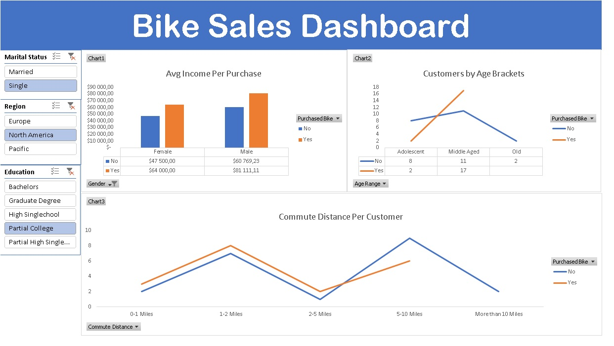

# 📊 Excel Data Analysis Project – Bike Buyers Dataset

---

## 📌 Project Overview

This project represents my **first data analysis project using Microsoft Excel**.

The goal of the project was to practice **data cleaning**, **data analysis**, and **interactive visualization** using Excel tools.

The project is based on the **Excel Data Analytics course by @AlexTheAnalyst**, where the **Bike Buyers Dataset** is analyzed to understand **customer demographics and purchasing behavior**.

This repository is part of my journey toward becoming a **Data Analyst**, combining analytical skills with my academic background in **Finance, Banking, and Insurance**.

---

## 🛠 Tools Used

**Microsoft Excel**

Key features used:

- Data Cleaning
- Pivot Tables
- Pivot Charts
- Slicers
- Data Visualization

---

## 🧹 Data Cleaning

To ensure **data accuracy and reliability**, the following data cleaning steps were performed on the dataset.

### ✔ Deleted Duplicates
Duplicate entries in the dataset were removed to avoid redundancy and maintain data integrity.

### ✔ Spelling Mistake Check
Each column was carefully reviewed to identify and correct spelling inconsistencies.  
This was done by examining the **unique values in each column using the filter menu**.

### ✔ Age Brackets
Age brackets were applied to categorize customers based on their age.

This transformation allows better **analysis and segmentation of the customer base**.

---

## 📈 Data Analysis

After cleaning the dataset, several analyses were performed using **Pivot Tables**.

### Average Income per Purchase

Pivot tables were created to calculate the **average income associated with bike purchases**.

This analysis provides insights into the **purchasing power and spending patterns of different customer segments**.

---

### Customer Commute Distance

Pivot tables were used to analyze **customer commute distance**.

This helps understand the preferences and requirements of customers based on their **commuting habits**.

---

### Customer Age Brackets

Another pivot table was created to analyze the **distribution of customers across different age brackets**.

This helps identify **target age groups and potential customer segments**.

---

## 📊 Pivot Charts and Slicers

To visualize and interact with the data, **Pivot Charts and Slicers** were implemented.

### Marital Status Slicer

This slicer allows users to filter data based on **customers' marital status**.

It provides a quick way to analyze the **impact of marital status on bike sales**.

---

### Education Slicer

The education slicer enables filtering based on **customers' education level**.

This helps understand how **education may influence bike purchasing behavior**.

---

### Region Slicer

The region slicer allows filtering data by **geographic region**.

This feature assists in analyzing **bike sales performance across different regions**.

---

## 🎯 Project Objectives

- Practice **data cleaning techniques**
- Apply **Excel analytical tools**
- Create **interactive dashboards**
- Build a **data analytics portfolio project**

---

## 👤 Author

**Aren Budaghyan**

Finance Graduate  
Junior Reinsurance Specialist  
Aspiring **Data Analyst**
